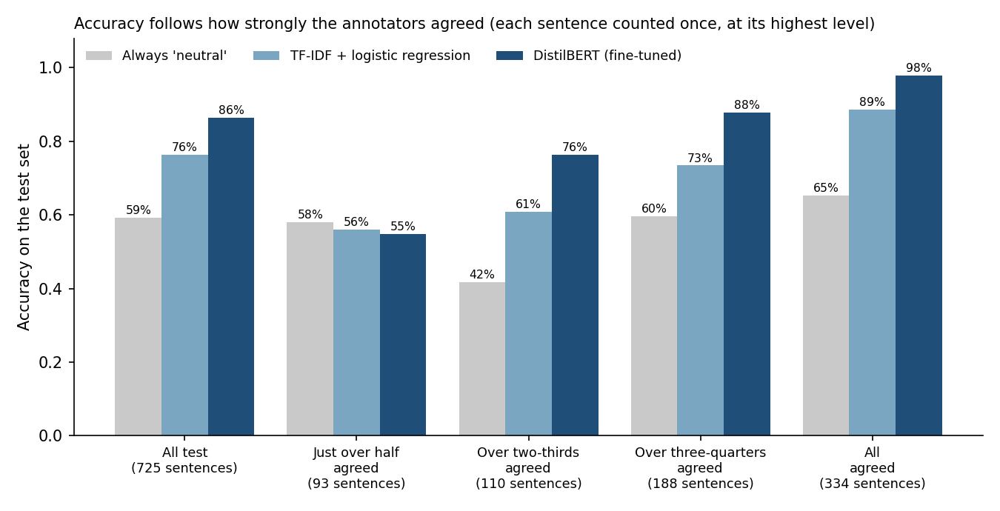
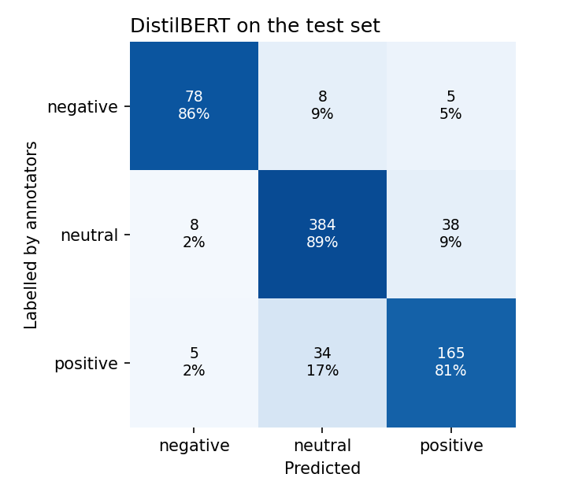
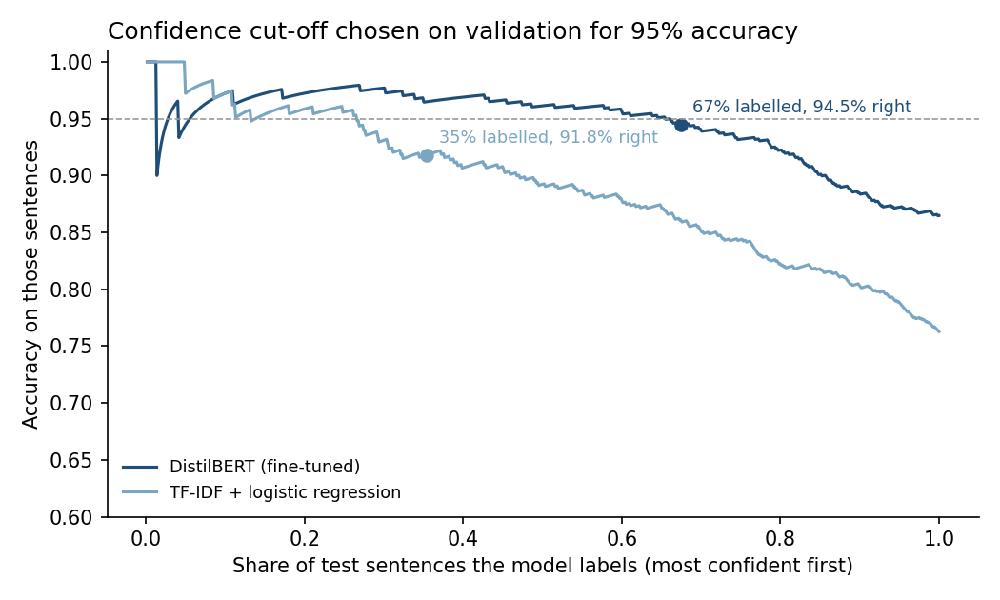
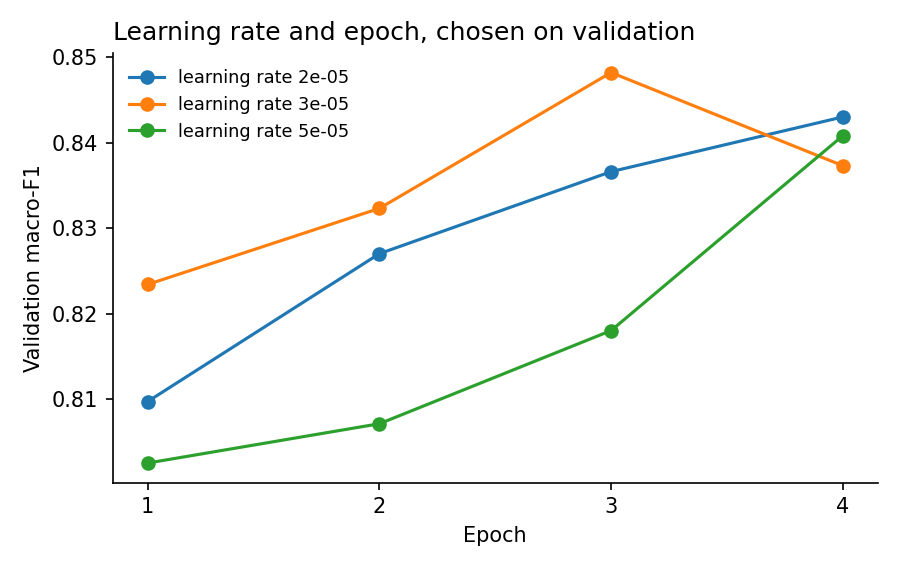

# Financial news sentiment with a fine-tuned transformer

**Question.** An analyst reads one line of financial news and knows at once
whether it is good or bad for the share price. Can a model do the same, and how
much does a transformer add over a classic text model?

**Data.** Financial PhraseBank (Malo et al., 2014): 4,846 sentences from English
financial news. Each one is labelled positive, negative or neutral "from the
view point of an investor" by 5 to 8 of 16 annotators with a finance background.
The dataset also records how strongly the annotators agreed: all of them on 47%
of the sentences, and only just over half on 13%.

**Cleaning, so the test is a real test.** Six repeated copies were removed. Two
sentences whose copies carried different labels were dropped. Sentences that
differ only in their numbers ("Operating profit rose to EUR 9.4 mn..." and
"...EUR 11.7 mn...") were kept on the same side of the split; a plain random split
would have put the twins of 6 test sentences in training. That leaves 4,836
sentences: 3,387 for training, 724 for validation and 725 for test. Each part
has the same mix of labels: 59% neutral, 28% positive, 12.5% negative.

**Three models**

| Model | Idea |
|---|---|
| Always "neutral" | the most common answer: the floor to beat |
| TF-IDF + logistic regression | counts of words and word pairs, weighted by rarity; the regularisation strength and class weights were chosen on validation from 12 settings |
| **DistilBERT, fine-tuned** | a 67-million-parameter transformer pre-trained on general English, fine-tuned here with a plain PyTorch loop (AdamW, warm-up then linear decay, gradient clipping). The learning rate and the number of epochs were chosen on validation, and the chosen setting was run with three seeds |

## Results: 725 test sentences, scored once

| | Accuracy | Macro-F1 | F1 negative · neutral · positive | Accuracy where all annotators agreed (334) |
|---|---|---|---|---|
| Always "neutral" | 59.3% | 0.25 | 0 · 0.74 · 0 | 65.3% |
| TF-IDF + logistic regression | 76.3% | 0.71 | 0.64 · 0.83 · 0.67 | 88.6% |
| **DistilBERT** (mean of 3 seeds) | **86.4%** ± 0.3 | **0.853** ± 0.004 | 0.86 · 0.90 · 0.80 | **97.8%** ± 0.5 |

**DistilBERT gets 86% of test sentences right, against 76% for TF-IDF.** On
sentences where every annotator agreed it gets 98%. Macro-F1 averages the three
classes equally, so the rare negative class counts as much as neutral; on it,
the transformer's lead is widest: 0.86 against 0.64. The ± is the standard
deviation over three training seeds.



## Where it goes wrong: mostly where people do

- **93% of its mistakes are on sentences the annotators themselves split over**,
  even though those sentences are only 54% of the test set.
- On the 93 sentences where only just over half the annotators agreed, **no
  model beats always answering "neutral"**: 58% for "neutral", 56% for TF-IDF,
  55% for DistilBERT. For these sentences the label is close to a coin toss.
- **It almost never confuses good news with bad:** the saved model calls a
  negative sentence positive, or a positive one negative, on 10 of 725 sentences
  (5 each way, 1.4%). Most of its mistakes are between positive and neutral: 72
  of 98.

Two of its most confident mistakes. Both labels were given by a bare majority of
the annotators:

> *Both loans will be used to finance strategic investments such as shopping
> center redevelopment projects and refinancing of maturing debt.* Labelled
> positive; the model says neutral, 99.7% sure.
>
> *Nokia Corp of Finland Tuesday said it has received a unified device
> managment contract with Finnish operator Elisa Oyj.* Labelled neutral; the
> model says positive, 99.5% sure.



## In use: let the model say "not sure"

The confidence cut-off was chosen on validation so that the sentences the model
labels on its own are 95% right. On the test set, **DistilBERT then labels 67%
of sentences on its own at 94.5% accuracy** and passes the other 33% to a
person; on those it would have been right 70% of the time. At the same cut-off
rule, TF-IDF could take only 35% of the sentences, at 91.8%. The test accuracy
lands just under the 95% target (validation gave 95.1%), because a cut-off
chosen on 724 sentences carries some noise.



## Cost

| | Size | Speed |
|---|---|---|
| TF-IDF + logistic regression | 2.2 MB | about 46,000 sentences a second on CPU |
| DistilBERT | 269 MB | about 290 sentences a second on the Apple M1 GPU, 210 on CPU |

The ten points of accuracy cost a model 120 times larger and over 200 times
slower on a CPU. Fine-tuning takes 5 minutes per run on the M1.

## Choices, all made on validation

- **Learning rate:** 2e-5, 3e-5 and 5e-5 gave a validation macro-F1 of 0.843,
  0.848 and 0.841; 3e-5 was chosen. At 2e-5 and 5e-5 the score was still rising
  at epoch 4, so a longer run might change this choice. That was not tried.
- **Epoch:** the best of four on validation: epochs 3, 4 and 4 for the three
  seeds.
- **Saved model:** the seed with the best validation score (seed 2).
- **TF-IDF:** C = 30 with balanced class weights.



**Why not FinBERT?** FinBERT is the best-known financial sentiment model, but it
was itself fine-tuned on Financial PhraseBank. Scoring it on this test set would
mean testing it on sentences it has probably seen in training.

## How it is checked

`tests.py` runs 60 checks:
- the four agreement files are nested, with the same label for the same sentence
- no sentence, and no copy of one with other numbers, sits in two of train,
  validation and test; each part has the full data's label mix
- no sentence is cut by the tokeniser (the longest is 150 tokens, the limit is
  160), and padding is masked
- TF-IDF beats always-neutral, and when trained on shuffled labels it learns
  nothing (macro-F1 0.34)
- **every choice is re-derived from the validation predictions**: the TF-IDF
  settings, the learning rate, the epoch, the saved seed and the confidence
  cut-off
- **the numbers quoted here are recomputed from the saved per-sentence
  predictions**:
  - every cell of the results table
  - accuracy at each level of agreement
  - the confusion matrix
  - the cut-off's coverage and accuracy
  - the share of mistakes where annotators split

  The test set's fingerprint must also match the one the code makes now.
- the saved model gets six hand-written sentences right

Seven bugs were planted on purpose, and each one is caught:
- splitting by sentence instead of by template
- keeping duplicates
- keeping the worst epoch
- leaving the padding unmasked
- an edited result
- a learning rate not chosen on validation
- a saved model not chosen on validation

## Run it

```bash
pip install -r requirements.txt
python get_data.py    # 0.7 MB, checked against its SHA-256 (not committed: licence)
python baseline.py    # a few seconds
python finetune.py    # about 26 minutes on an Apple M1: five runs of 5 minutes
python evaluate.py    # writes results/
python tests.py       # 60 checks
python predict.py "Operating profit rose to EUR 12 mn from EUR 8 mn." "The company will cut 300 jobs after sales fell."
```

```
positive 99.5%  (TF-IDF: positive 100.0%)  Operating profit rose to EUR 12 mn from EUR 8 mn.
negative 99.1%  (TF-IDF: negative 93.8%)  The company will cut 300 jobs after sales fell.
```

**Data:** Financial PhraseBank v1.0. Malo, P., Sinha, A., Takala, P., Korhonen,
P. and Wallenius, J. (2014), "Good debt or bad debt: Detecting semantic
orientations in economic texts", *Journal of the Association for Information
Science and Technology*. Licence CC BY-NC-SA 3.0, non-commercial. The dataset is
not stored in this repository: the saved predictions refer to sentences by a
fingerprint, and only the twelve sentences kept as error examples (in
`results/metrics.json`, two of them quoted above) appear in full.
